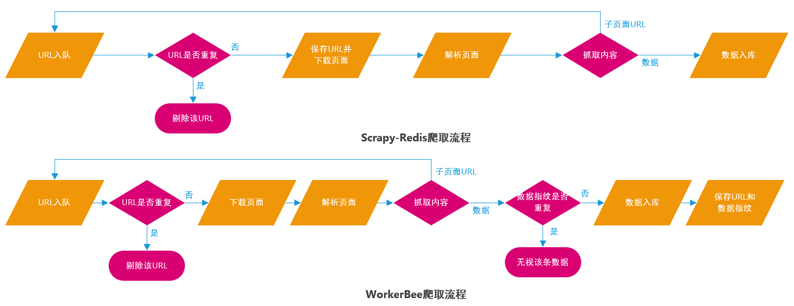

# WorkerBee

Data filter components Based on Scrapy, Scrapy-Redis

一个基于Scrapy、Scrapy-Redis的数据去重组件包


## Introduction

WorkerBee的诞生源自于使用原生Scrapy-Redis时发现的一些不足之处，例如URL去重持久化是存判同时进行，如果后续流程出错，那么此条数据将不会再被访问和捕捉；针对一些需要爬取更新且无法使用URL去重的应用场景，Scrapy-Redis没有提供数据级别的去重方案



WorkerBee修改了一小部分Scrapy-Redis的业务逻辑，将URL的持久化后移`Pipeline`进行，改造`Item`使其能生成数据指纹并使用布隆过滤器实现数据去重，适用于数据规模较小、数据质量要求高并且需要更新增量的应用场景


## Install

通过wheel安装，wheel在release中发布

```shell
$ pip install <wheel_file_name>.whl
```

检查版本信息

```shell
$ workerbee -v
```


## Start

开始第一个WorkerBee项目，请优先配置好Redis(version > 5.0)和存储数据库

#### 创建项目

```shell
$ workerbee startproject default
```

以上命令将会在当前路径下生成一个Scrapy爬虫项目，项目名为default

目录结构如下

```text
default
       ├─ default
       │   ├── __init__.py
       │   ├── item.py
       │   ├── middlewares.py
       │   ├── settings.py
       │   └── spiders
       │       			└── __init__.py
       ├─ __version__.py
       └─ scrapy.cfg
```

#### 生成爬虫

进入项目文件夹

```shell
$ cd default
```

通过默认模板生成一个爬虫

```shell
$ workerbee genspider helloworld
```

以上命令将会在 `default/spiders` 路径下生成一个爬虫文件，爬虫名为helloworld

#### 定义Item

继承`workerbee.item`并实现两个抽象函数`make_fingerprint`、`fingerprint`，分别用于生成、获取数据指纹

```python
    # return fingerprint of item
    # abstractmethod ! Must be overload in the Subclass
    @abstractmethod
    def fingerprint(self):
        pass

    # define the way to make fingerprint of item
    # abstractmethod ! Must be overload in the Subclass
    @abstractmethod
    def make_fingerprint(self):
        pass
```

#### 编写爬虫

`spider`、`middleware`的编写、使用规则大部分与Scrapy爬虫无异

唯一需要注意的一点是，WorkerBee在`Item`的处理上与Scrapy有所不同，必须在将`Item`递交给管道之前保存该页面的`Request`对象并计算数据指纹

```python
...
item = DemoItem()
# save the request of page
item['request'] = response.request

...
# calculate fingerprint
item.make_fingerprint()
yield item
```

#### 运行

```shell
$ scrapy crawl <spider_name>
```


## Components

### Filter 过滤器

- #### RFPDupeFilterAlter

WorkerBee修改了Scrapy-Redis的`RFPDupeFilter`，去除了其在判断的同时直接将请求持久化的功能，使去重持久化能后移至数据入库部分进行

```python
DUPEFILTER_CLASS = 'workerbee.dupefilter.RFPDupeFilterAlter'  # settings.py
```

- #### BloomFilter

布隆过滤器，采用多重哈希映射去重，拥有使用较小存储空间过滤海量数据的能力。WorkerBee利用布隆过滤器和数据指纹对所有捕获到的数据去重

布隆过滤器内嵌于WorkerBee的管道组件`MysqlPipeline`中，启用MysqlPipline即可配置


### LogFormatter 日志格式

- #### PoliteLogFormatter

WorkerBee使用自定义的LogFormatter修改Scrapy默认的一些`Exception`的输出方式，使日志更清晰易读

```python
LOG_FORMATTER = 'workerbee.logformatter.PoliteLogFormatter'  # settings.py
```


### Item 条目

- #### ITEM

WorkerBee的`Item`是`Scrapy.Item`的子类

```python
    # save the request of item
    request = scrapy.Field()

    # return fingerprint of item
    # abstractmethod ! Must be overload in the Subclass
    @abstractmethod
    def fingerprint(self):
        pass

    # define the way to make fingerprint of item
    # abstractmethod ! Must be overload in the Subclass
    @abstractmethod
    def make_fingerprint(self):
        pass
```

Item中定义了一个`request`字段用于存储该数据对应的`Scrapy.Request`对象，两个抽象函数`make_fingerprint`、`fingerprint`分别用于生成、获取数据唯一标识，***必须在子类中实现***


### Pipeline 管道

由于数据指纹和URL持久化放到了`Pipeline`部分进行，所以使用不同的存储数据库都需要编写特定的管道文件，目前只提供了Mysql支持

- #### MysqlPipeline

WorkerBee实现了一个自适应Mysql管道，可根据Item的结构自动改变存储语句，数据库列名即Item各属性名

配置参数：

`REDIS_BLOCKNUM`    `default 2`

内嵌的布隆过滤器存储块个数，一个block占用256M内存空间，Redis开启持久化内存占用会翻倍，能提供万分之一误检率下的9千万数据的去重，可根据需要增加block个数

- 共用同一个Redis上布隆过滤空间的所有爬虫此参数原则上应保持一致，后续不能修改，在设置此参数前应充分考量项目扩展性和硬件设备运行性能

`MYSQL_HOST`    `default localhost`

连接地址

`MYSQL_PORT`    `default 3306`

端口

`MYSQL_USER`    `default root`

用户名

`MYSQL_PASSWORD`

用户密码

`MYSQL_DB`

数据库名

`MYSQL_CHARSET`    `default utf-8`

插入数据的编码格式

`MYSQL_TABLE`

数据表

`MYSQL_UPSERT`    `default False`

**不执行数据去重**且添加数据时如有主键重复则执行更新，否则正常插入


### Extensions 扩展

- #### AutoClose

使爬虫请求队列在保持一段时间空闲（即没有新的请求入队）之后自动关闭爬虫

配置参数：

`WAIT_MIN`    `default 5`

队列空闲时间，单位：分钟

- #### AutoStart

自动向Redis加入Start URL开启爬虫，要求爬虫拥有`start_url`成员变量

- #### ClearRequests

在爬虫关闭时清空爬虫的请求队列

- #### Monitor

监控爬虫运行状态，如果出现大量错误，则叫停爬虫并向Server反馈，爬虫正常运行结束后同样会向Server反馈，**反馈功能需要配合另一个可视化项目 [PyHive](https://github.com/Frank-ZYW/PyHive.git) 使用**

配置参数：

`MONITOR_SPIDERERROR`    `default 0`

页面下载至数据入库之间流程的错误数量，一般为Request对象的各个callback（页面解析函数）错误，达到该数量后爬虫将被强制关停，关停理由为`closespider_spidererror`，如果设置为0，Monitor将不监控此项

`MONITOR_ITEMERROR`    `default 0`

数据入库流程的错误数量，一般为数据库插入错误，达到该数量后爬虫将被强制关停，关停理由为`closespider_itemerror`，如果设置为0，Monitor将不监控此项

`MONITOR_TIMEOUT`    `default 0`

爬虫运行超时错误，单位：小时，达到该时间后爬虫将被强制关停，关停理由为`closespider_timeout`，如果设置为0，Monitor将不监控此项

`MONITOR_REQUESTIGNORE`    `default 0`

网页（包括多次重试后）无法正常加载，被舍弃错误，达到该数量后爬虫将被强制关停，关停理由为`closespider_requestignore`，如果设置为0，Monitor将不监控此项，此项必须与下载中间件`RetryMiddleware`共用

`MONITOR_FEEDBACK`    `default True`

是否向Server反馈爬虫运行信息，***生产环境建议启用，开发环境可以停用便于调试***

`MONITOR_SERVER_API`

Server端用于接收反馈信息的接口，接口字符串中需要保留一个`<spider_name>`，该位置将被爬虫名替代，例如：

```shell
'http://127.0.0.1:8000/api/spider/<spider_name>/feedback'
```

在`MONITOR_FEEDBACK`属性为`False`时该属性无效


### DownloaderMiddleware 下载中间件

- #### RetryMiddleware

类似于Scrapy官方提供的重载中间件，内置网页舍弃数量统计器，为`Monitor`扩展提供支持，使用时建议禁用Scrapy官方重载中间件

配置参数：

`RETRY_TIMES`    `default 2`

最大重试次数（包括第一次加载）

`RETRY_HTTP_CODES`    `default [500, 502, 503, 504, 522, 524, 408, 429]`

需要重试的HTTP状态

- #### SeleniumChromeMiddleware

内置控制`Chrome`的`Selenium`，建议使用常规中间件继承`SeleniumChromeMiddleware`来获取调用Chrome加载网页的能力

```python
    def __init__(self, crawler):
        # create a headless browser
        options = Options()
        options.add_argument("--headless")
        options.add_argument("--disable-gpu")
        options.add_argument('--no-sandbox')
        self.browser = webdriver.Chrome(options=options)
```

`SeleniumChromeMiddleware`本质上是通过构造函数构建一个`WebDriver`对象，保存在成员变量`browser`中，在子类中可以通过`self.browser`调用`WebDriver`对象

- ***继承该中间件的子类必须实现如下函数***

```python
    @classmethod
    def from_crawler(cls, crawler):
        return cls(crawler)
```

配置参数：

`SELENIUM_PROXY    `

Selenium不支持Scrapy自带的`HttpProxyMiddleware`模块提供的代理功能，如需要使用Selenium加载代理网页，则填写此参数，支持socks、http、https代理，例如：

```python
'socks5://127.0.0.1:1081'
```


## Client

WorkerBee完全可以单机独立单次运行，但如果希望更好的配合 [PyHive](https://github.com/Frank-ZYW/PyHive) 完成爬虫服务的长期部署、GUI运行调度，需要借助 [Scrapyd](https://github.com/scrapy/scrapyd) 构建可供PyHive控制的从机客户端

- 以下部署过程仅完全适用`RedHat/CentOS`系列Linux


### **Chrome**

Chrome用于支持某些需要使用selenium的爬虫运行

下载最新版本的安装包，在当前路径下保存

```shell
$ wget https://dl.google.com/linux/direct/google-chrome-stable_current_x86_64.rpm 
```

通过yum来安装rpm包

```shell
$ yum install -y google-chrome-stable_current_x86_64.rpm
```

查看Chrome版本

```shell
$ /opt/google/chrome/chrome --version
```

测试（使用百度主页），截图被保存则安装成功

```shell
$ google-chrome-stable --no-sandbox --headless --disable-gpu --screenshot https://www.baidu.com/

# result
[0307/195726.201193:INFO:headless_shell.cc(619)] Written to file screenshot.png.
```


### **ChromeDriver**

ChromeDriver是Selenium控制Chrome的桥梁，ChromeDriver与Chrome的版本紧密相关，请根据你所安装的Chrome版本，前往 [ChromeDriver官方站点](https://chromedriver.chromium.org/) 下载对应的ChromeDriver并放置在系统的路径下，Selenium将会自动检索该路径。当然，您也可以放置在任意目录下，但需要在代码中明确告知Selenium具体的存放路径

生产环境不建议频繁对Chrome进行升级，如若必须升级请检查ChromeDriver的适配性


### **Scrapyd**

Scrapyd是Scrapy官方提供的用于运行Scrapy蜘蛛的服务，它允许使用HTTP JSON API部署Scrapy项目并控制蜘蛛运行

```shell
$ pip install scrapyd
```

编写配置文件设定Scrapyd运行参数

新建以下目录、文件

```shell
$ sudo mkdir -p /etc/scrapyd
$ sudo vim /etc/scrapyd/scrapyd.conf
```

写入:

```tex
[scrapyd]
eggs_dir = /etc/scrapyd/eggs
logs_dir = /etc/scrapyd/logs
items_dir =
jobs_to_keep = 5
dbs_dir = /etc/scrapyd/dbs
max_proc = 5
max_proc_per_cpu = 5
finished_to_keep = 100
poll_interval = 5.0
bind_address = 0.0.0.0
http_port = 6800
runner = scrapyd.runner
application = scrapyd.app.application
launcher = scrapyd.launcher.Launcher
webroot = scrapyd.website.Root

[services]
schedule.json = scrapyd.webservice.Schedule
cancel.json = scrapyd.webservice.Cancel
addversion.json = scrapyd.webservice.AddVersion
listprojects.json = scrapyd.webservice.ListProjects
listversions.json = scrapyd.webservice.ListVersions
listspiders.json = scrapyd.webservice.ListSpiders
delproject.json = scrapyd.webservice.DeleteProject
delversion.json = scrapyd.webservice.DeleteVersion
listjobs.json = scrapyd.webservice.ListJobs
daemonstatus.json = scrapyd.webservice.DaemonStatus
```

参数含义、HTTP JSON API及更多配置请参考 [Scrapyd官方文档](https://scrapyd.readthedocs.io/en/stable/config.html)


### **WorkerBee**

WorkerBee爬虫将在Scrapyd调度下工作，请将WorkerBee安装至Scrapyd所在的Python环境


### **Supervisor**

Supervisor是一个由Python编写的进程守护工具，其可以起到保护Scrapyd应用进程的作用

首先更新系统软件包

```shell
$ sudo yum update -y
```

CentOS 7默认信息库中没有Supervisor，需要预先安装EPEL信息库

```shell
$ sudo yum install epel-release
```

更新并安装Supervisor

```shell
$ sudo yum update
$ sudo yum -y install supervisor
```

安装完成后可以在 `/etc` 目录下找到以下文件和目录（`Debian/Ubuntu`系列Linux中位于 `/etc/supervisor` 目录下）

```shell
$ /etc/supervisord.conf  # 主配置文件
$ /etc/supervisord.d  # 应用配置文件夹，用于存放需要supervisor守护的应用的相关配置文件
```

新建应用配置文件

```shell
$ sudo vim /etc/supervisord.d/scrapyd.ini
```

**配置文件的类型和存放路径可以改变，详见 `supervisord.conf` 文件最后几行内容，如有需求可根据需要自行修改

```ini
[include]
files = supervisord.d/*.ini
```

写入、保存

```ini
# supervisor不通过bash启动所以不会读取系统环境变量，需手动添加
[supervisord]
# 代理环境变量样例
environment=http_proxy=http://127.0.0.1:8081,https_proxy=http://127.0.0.1:8081

[program:scrapyd]
command=/path/to/your/python/env/bin/scrapyd
stdout_logfile=/etc/scrapyd/run.log
user=root
autostart=true
autorestart=true
redirect_stderr=True
```

使用以下命令启动Supervisor并允许其在系统自启引导时自动加载

```shell
$ sudo systemctl start supervisord
$ sudo systemctl enable supervisord
```

检查所有守护进程状态

```shell
$ supervisorctl
```

Scrapyd默认服务位于6800端口，测试API

```shell
$ curl http://localhost:6800/daemonstatus.json

# result
{"node_name": "demo", "status": "ok", "pending": 0, "running": 0, "finished": 0}
```

更多Supervisor操作、配置请参见[Supervisor官方文档](http://supervisord.org/)